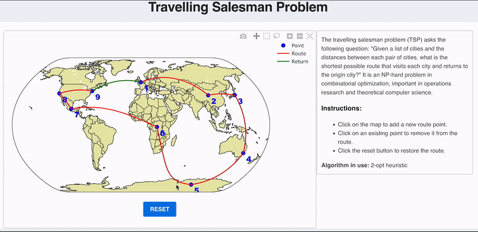

## Travelling salesman demo

Visualize the travelling salesman problem with a map in which you can add and remove stops with a click. 

The optimization problem is solved with JuMP for up to 9 stops, and the heuristic two-opt algorithm afterwards. The plot is implemented with PlotlyJS.

**Notice**: as of now, this app can only be accessed by one user. If other users acces it at `/`, they'll all share the same session object.

