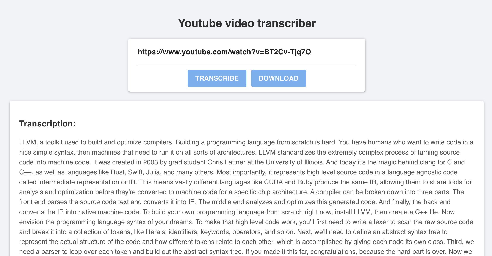

## Youtube video transcriber

Transcribe audio from Youtube videos using [Whisper.jl](https://github.com/aviks/Whisper.jl), a Julia package for Automatic Speech Recognition (ASR) that leverages OpenAI's Whisper model.

Requeriments:
- `yt-dlp` for downloading and extracting the audio.
- `ffmpeg` for transcoding the audio.

Usage:
- First, download the audio of the video with the "Download" button.
- Next, transcribe the audio with the "Transcribe" button. This can take a while.
- To use a different [Whisper model](https://github.com/aviks/Whisper.jl), edit the call to `transcribe` in `whisper.jl`

